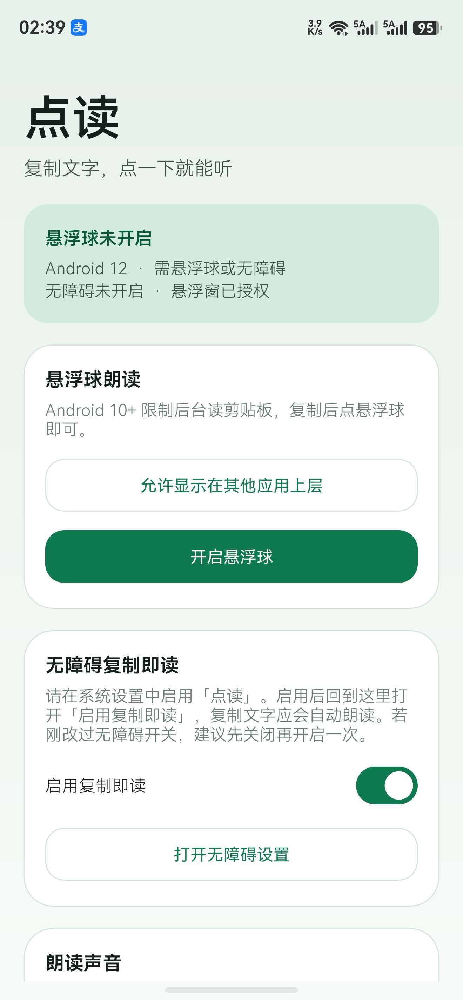
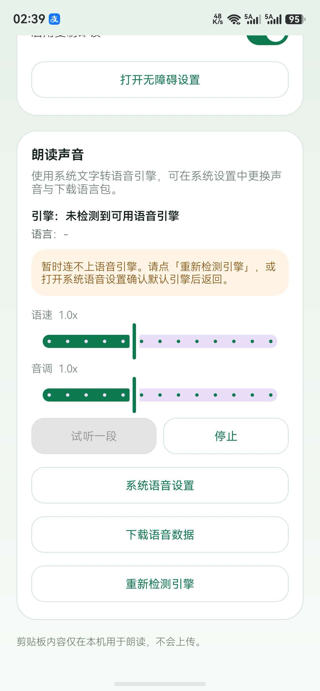
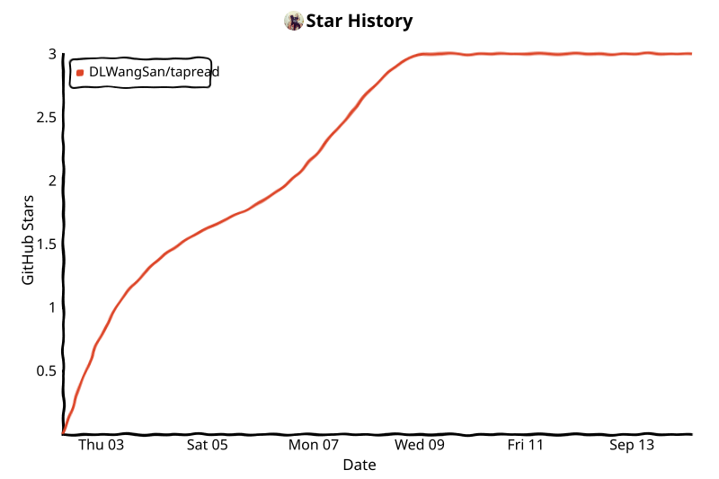

# 点读 · TapRead

<p align="center">
  <a href="./README.md">English</a> | <strong>简体中文</strong>
</p>

<p align="center">
  <a href="https://github.com/DLWangSan/tapread/releases/latest"></a>
  <a href="./LICENSE"></a>
  
  
</p>

<p align="center">
  <b>复制文字，点一下就能听。</b><br/>
  面向长辈与阅读困难用户的 Android 全局朗读工具。不做 OCR，直接调用系统文字转语音（TTS）。
</p>

<p align="center">
  
  &nbsp;
  
</p>

## 为什么做点读

Android 10 起，普通后台应用无法随意读取剪贴板；微信关怀模式能读聊天，却读不了朋友圈。点读只保留一个动作：

> 看不懂 → 复制 → 听。

## 功能

- **Android 9 及以下**：复制即自动朗读
- **Android 10+**：复制后点悬浮球；也可开无障碍实现复制即读
- 对接系统 TTS：语速 / 音调，并可跳转系统语音设置
- 自动跳过过短文本与简单验证码
- 剪贴板内容仅本机朗读，不上传

## 模式说明

| 系统版本 | 推荐方式 |
| --- | --- |
| ≤ 9 | 剪贴板监听：复制即读 |
| ≥ 10 | 悬浮球（默认）+ 可选无障碍自动读 |

## 安装

1. 从 [Releases](https://github.com/DLWangSan/tapread/releases/latest) 下载最新 APK  
2. 安装到 Android 8.0+（API 26+）  
3. 授予「显示在其他应用上层」，开启悬浮球  
4. （可选）在系统无障碍中启用「点读」，实现复制即读  

> 若更新了无障碍相关版本，请到系统设置中**关闭再重新开启**「点读」服务。

## 快速开始

1. 在微信 / 浏览器等任意 App 中复制文字  
2. 点绿色喇叭悬浮球 → 开始朗读  
3. 朗读中再点一次可停止  

## 构建

```bash
./gradlew :app:assembleRelease
# 或调试包
./gradlew :app:assembleDebug
```

需要：JDK 17+、Android SDK 35。

## 隐私

- 剪贴板内容只用于本机朗读  
- 无账号、无统计 SDK、不上传复制文本  
- 无障碍模式仅关注复制相关事件 / 剪贴板变化  

## Star History

> **说明（2026）：** GitHub 已将公开 stargazers API 限制为仓库管理员/协作者可访问。
> 托管在 `api.star-history.com` 的在线图表对多数仓库会空白。
> 本仓库使用 [star-history-action](https://github.com/narayann7/star-history-action)，
> 在 CI 中用仓库自身权限生成静态图表。

<p align="center">
  <a href="https://www.star-history.com/#DLWangSan/tapread&Date">
    <picture>
      <source media="(prefers-color-scheme: dark)" srcset="./assets/star-history/star-history-dark.svg" />
      <source media="(prefers-color-scheme: light)" srcset="./assets/star-history/star-history-light.svg" />
      
    </picture>
  </a>
</p>

## License

[MIT](./LICENSE) © DLWangSan
